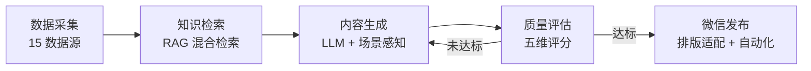

# smart-content-creator

> **让内容生产从"人工周更"到"智能日更"** —— 企业公众号智能创作与发布平台

<p align="center">
  <a href="LICENSE"></a>
  <a href="#"></a>
  <a href="#"></a>
  <a href="#"></a>
  <a href="#"></a>
</p>

**smart-content-creator** 是一个端到端的企业内容自动化生产平台，将「行业资讯采集 → 知识增强生成 → 质量评估 → 公众号发布」整条链路封装为一条可定时、可闭环、可监控的流水线。

它最初为一家环保设备企业打造，但架构是行业无关的——只要替换知识库与业务规则，即可服务任意需要持续产出专业内容的组织。

---

## ✨ 为什么选择它

- **全链路自动化**：从素材发现到发布完成，一条流水线跑通，无需人工干预
- **知识增强生成**：RAG 检索企业私有知识库，生成内容贴合业务、数据可信，而非空泛套话
- **场景感知**：自动识别地域、时间、受众与调性，让内容"在对的时间说对的话"
- **质量有保障**：五维评估 + 闭环重试，未达标自动修订，合格才放行
- **永不闪退**：全模块容错装配，任何依赖缺失都能降级运行，快速体验流程

## 🚀 主要功能

| 模块 | 能力 |
|------|------|
| **数据采集** | 15 类行业/政策/产品数据源自动抓取与分类，支持 JS 动态渲染页面 |
| **知识检索** | RAG 语义检索 + 关键词混合搜索，命中空时自动回退本地知识库 |
| **内容生成** | LLM 生成 + 场景感知业务规则（地域 / 时间 / 受众 / 调性 / 内容类型） |
| **质量评估** | 五维评分（准确率 / 合规 / 可读 / 品牌 / 专业）+ 术语、逻辑、可读性、建议四大子模块 |
| **配图建议** | 自动规划封面图与插图位，输出 AI 生图提示词与建议尺寸 |
| **微信发布** | 排版适配引擎（内联样式 + 品牌色）+ Selenium 自动化 + 官方 API 接口 + 本地模拟预览 |
| **定时调度** | APScheduler + DAG Pipeline + 闭环重试 + SLA 监控，节点触发准确率 ≥ 98% |

## 🏭 企业应用场景

| 场景 | 痛点 | 本项目如何解决 |
|------|------|----------------|
| **B2B 工业 / 设备制造** | 技术内容专业性强，产出慢、难持续 | 采集行业政策与竞品动态，生成技术干货与解决方案类推文，树立专业形象 |
| **政务 / 园区运营** | 政策解读时效要求高、口径需准确 | 自动追踪政策源，结合本地知识库生成合规、准确的解读内容 |
| **行业媒体 / 资讯** | 多源信息聚合成本高 | 15 源自动聚合 + 分类，一键生成结构化资讯 |
| **品牌内容营销** | 内容调性不一致、更新频次低 | 品牌调性 + 受众画像约束生成，保证风格统一、稳定日更 |
| **企业知识库运营** | 知识沉淀后无法转化为对外内容 | 以 RAG 打通内部知识 → 对外内容，实现"一次沉淀、持续输出" |

## 🧩 工作流程



## 🔧 技术优势

| 维度 | 说明 |
|------|------|
| **工程健壮性** | 每个外部模块均有 `try-except` 容错与 Dummy 兜底，缺失依赖也能启动 |
| **内容可控性** | 五维评估 + 子模块交叉校验，确保术语准确、逻辑自洽、合规达标 |
| **发布灵活性** | 双模式发布：浏览器自动化（Selenium）与官方 API 接口，另支持本地模拟预览 |
| **调度可靠性** | DAG 依赖编排 + 失败闭环重试 + SLA 监控，触发准确率 ≥ 98% |
| **可扩展性** | 模块化设计，接口签名清晰，新增数据源 / 场景 / 发布渠道成本低 |
| **低成本接入** | 兼容任意 OpenAI 协议 LLM，可通过 `LLM_BASE_URL` 切换 DeepSeek / 通义 / 私有模型 |

## 📖 操作方法

### 环境要求

- Python 3.10+
- Docker（可选，用于 Qdrant 向量数据库）

### 第一步：安装

```bash
git clone https://github.com/tonylyles/smart-content-creator.git
cd smart-content-creator
pip install -r requirements.txt
```

### 第二步：配置

```bash
# 复制环境变量模板
cp .env.example .env
```

编辑 `.env`，至少填写 LLM 配置：

```ini
LLM_API_KEY=sk-your-api-key-here
LLM_BASE_URL=https://api.deepseek.com/v1
```

> 💡 未配置 `LLM_API_KEY` 时，系统会以容错模式启动并生成示例内容，便于先跑通流程。

### 第三步：启动

```bash
# 方式一：一键启动（Windows，自动装依赖并打开浏览器）
启动.bat

# 方式二：手动启动 Web 界面
python run_ui.py

# 方式三：命令行全链路测试（打印端到端结果）
python src/main.py
```

浏览器访问 **http://127.0.0.1:7860**，即可在可视化界面中完成内容生成、质量评估、配图建议与发布。

### 第四步：启用向量检索（可选，生产推荐）

```bash
docker-compose up -d
```

启动 Qdrant 后，RAG 检索将从内存模式切换为生产级语义检索。

### 定时自动发布

系统内置 APScheduler 调度器，可在 `src/config.py` 中配置抓取、生成、数据清洗的时间间隔，实现无人值守的每日自动生产。

## 📁 项目结构

```
smart-content-creator/
├── src/
│   ├── main.py                    # 系统入口（容错装配）
│   ├── config.py                  # 全局配置中心
│   ├── workflow.py                # 工作流引擎 + 业务规则
│   ├── scheduler.py               # 调度器 + DAG Pipeline + 触发引擎
│   ├── prompt_engine.py           # 提示词引擎
│   ├── generator.py               # 内容生成器
│   ├── evaluator.py               # 质量评估器
│   ├── ui.py                      # Gradio Web 界面
│   ├── publisher/                 # 微信发布（排版适配 + Selenium + API）
│   ├── generator/                 # 排版引擎 + 多模态配图
│   ├── quality/                   # 术语 / 逻辑 / 可读性 / 建议子模块
│   ├── rag/                       # 混合检索 + 向量库
│   ├── spiders/                   # 15 数据源爬虫 + 分类 + 发布规划
│   └── data_storage.py / knowledge_base.py / data_cleaner.py
├── data/jikang_knowledge.md       # 示例知识库（可替换为你的行业知识）
├── tests/                         # 测试脚本
├── run_ui.py                      # UI 启动脚本
├── init_knowledge.py              # 知识库初始化
├── docker-compose.yml             # Qdrant 容器配置
└── requirements.txt               # Python 依赖
```

## 🛠 技术栈

- **LLM**：DeepSeek（兼容任意 OpenAI 协议服务）
- **向量数据库**：Qdrant
- **Web 框架**：Gradio
- **爬虫**：requests + BeautifulSoup + Selenium
- **调度**：APScheduler + SQLAlchemy

## 🎯 如何适配你的行业

本项目采用「场景感知」设计，通过配置即可适配不同行业：

1. 替换 `data/jikang_knowledge.md` 为你所在领域的知识库
2. 在 `src/config.py` 中调整「地域 → 场景」映射与业务规则
3. 在 `src/prompt_engine.py` 中定制内容调性与受众画像
4. 更新 `src/spiders/news_crawler.py` 中的数据源列表

## 🤝 贡献

欢迎提交 Issue 与 Pull Request，详见 [CONTRIBUTING.md](CONTRIBUTING.md)。行为规范见 [CODE_OF_CONDUCT.md](CODE_OF_CONDUCT.md)。

## 📄 许可证

[MIT](LICENSE)

## ⚠️ 免责声明

本项目的公众号发布功能仅用于自动化内容排版与流程演示，请遵守微信公众号平台相关规范及当地法律法规。`data/` 目录下的知识库内容仅为示例，不代表任何企业的官方立场。
