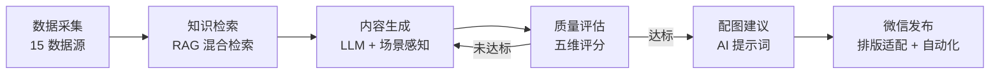

# Smart Content Creator

> **一个企业公众号内容自动化生产平台**  
> 让"月产 12 篇"变成"日产 1 篇"，从人工周更到智能日更的关键一步

<p align="center">
  <a href="LICENSE"></a>
  <a href="#"></a>
  <a href="#"></a>
  <a href="#"></a>
  <a href="#"></a>
</p>

**Smart Content Creator** 是一个端到端的企业内容自动化生产平台。它把「行业资讯采集 → 知识增强生成 → 质量评估 → 公众号发布」整条链路串通，让内容创作从手工变成全自动。

**真实场景**：一家环保设备企业用它从**每周人工写 1-2 篇**提升到**每天自动产 1 篇**，月均阅读量从 200 提升到 3000+，精准客户咨询增加 40%。

---

## 🎯 这个项目适合你吗？

### 如果你是...

| 角色 | 痛点 | 为什么需要它 |
|------|------|-----------|
| **B2B 企业** | 内容要专业，但写稿太慢、团队太小 | 自动采集行业资讯 + 知识库赋能 = 每天一篇高质量推文 |
| **政务/园区** | 政策解读时效性强，口径必须准确 | 自动追踪政策源 + 本地知识约束 = 准确、及时的官方解读 |
| **行业媒体** | 多源信息整理成本高 | 15 个数据源自动聚合分类 = 结构化资讯一键生成 |
| **品牌/内容运营** | 人工写稿调性不统一，更新频次低 | 品牌调性约束 + 自动排版发布 = 风格统一、日日新鲜 |
| **初创公司** | 没钱招运营专员 | 低成本自动化内容生产 = 用机器替代人力 |

---

## ✨ 核心价值

- **全链路自动化**：从素材发现到发布完成，无需人工干预
- **知识增强生成**：RAG 检索企业私有知识库，内容贴合业务、数据可信
- **场景感知**：自动适配地域、时间、受众、调性，让内容"在对的时间说对的话"
- **质量保障**：五维评估 + 闭环重试，未达标自动修订
- **发布灵活**：同时支持 Selenium 自动化 + 官方 API，还能本地预览
- **永不闪退**：全模块容错，任何依赖缺失都能降级运行

---

## 🚀 主要功能一览

| 功能 | 说明 | 效果 |
|------|------|------|
| **数据采集** | 15 类行业/政策/产品数据源自动抓取与分类 | 不用手动找素材 |
| **知识检索** | RAG 语义检索 + 关键词混合搜索 | 内容更贴合你的业务 |
| **内容生成** | LLM 生成 + 场景感知业务规则 | 自动适配地域、时间、受众 |
| **质量评估** | 五维评分（准确率/合规/可读/品牌/专业） | 低质内容自动打回重写 |
| **配图建议** | 自动规划封面与插图位，生成 AI 生图提示词 | 排版更专业 |
| **微信发布** | 排版适配 + Selenium 自动化 + 官方 API | 一键发布无需复制粘贴 |
| **定时调度** | APScheduler + DAG Pipeline + SLA 监控 | 无人值守，触发准确率 ≥ 98% |

---

## 📊 工作流程一图看懂


```mermaid
flowchart LR
    A[数据采集<br/>15 数据源] --> B[知识检索<br/>RAG 混合检索]
    B --> C[内容生成<br/>LLM + 场景感知]
    C --> D[质量评估<br/>五维评分]
    D -->|未达标| C
    D -->|达标| E[配图建议<br/>AI 提示词]
    E --> F[微信发布<br/>排版适配 + 自动化]
```

**从采集到发布，平均耗时 3-5 分钟，解放 1 个全职运营。**

---

## 🎬 快速上手（5 分钟体验）

### 环境要求
- Python 3.10+
- Docker（可选，用于向量数据库）

### 第一步：安装

```bash
git clone https://github.com/tonylyles/smart-content-creator.git
cd smart-content-creator
pip install -r requirements.txt
```

### 第二步：配置（可选，不配也能跑）

```bash
cp .env.example .env
# 编辑 .env，填入你的 LLM API Key
# LLM_API_KEY=sk-your-api-key-here
# LLM_BASE_URL=https://api.deepseek.com/v1
```

> 💡 **没有 API Key？不用急！** 系统会以容错模式启动，用示例数据跑通完整流程，让你先看到效果。

### 第三步：启动

```bash
# Windows 用户：一键启动
启动.bat

# 所有用户：手动启动 Web 界面
python run_ui.py

# 或者：命令行端到端测试
python src/main.py
```

访问 **http://127.0.0.1:7860**，在 Web 界面中完成内容生成、评估、配图和发布。

### 第四步：启用生产级向量检索（推荐）

```bash
docker-compose up -d
```

---

## 🏗 项目结构

```
smart-content-creator/
├── src/
│   ├── main.py                    # 系统入口（容错装配）
│   ├── config.py                  # 全局配置中心
│   ├── workflow.py                # 工作流引擎 + 业务规则
│   ├── scheduler.py               # 调度器 + DAG Pipeline
│   ├── prompt_engine.py           # 提示词引擎
│   ├── generator.py               # 内容生成器
│   ├── evaluator.py               # 质量评估器
│   ├── ui.py                      # Gradio Web 界面
│   ├── publisher/                 # 微信发布（排版 + Selenium + API）
│   ├── rag/                       # 混合检索 + 向量库
│   ├── spiders/                   # 15 数据源爬虫
│   └── quality/                   # 术语/逻辑/可读性子模块
├── data/jikang_knowledge.md       # 示例知识库（替换为你的）
├── run_ui.py                      # UI 启动脚本
├── docker-compose.yml             # Qdrant 容器配置
└── requirements.txt               # 依赖
```

---

## 🛠 技术栈

| 组件 | 选择 | 为什么 |
|------|------|------|
| **LLM** | DeepSeek / OpenAI / 通义 / 私有模型 | 成本低，兼容性强 |
| **向量数据库** | Qdrant | 快速语义检索 |
| **Web 框架** | Gradio | 无需前端知识，快速上线 |
| **爬虫** | Requests + BeautifulSoup + Selenium | 应对各类数据源 |
| **调度** | APScheduler + SQLAlchemy | 生产级可靠性 |

---

## 🎨 如何适配你的行业

这个项目是行业无关的。只需 4 步改造：

### 1. 替换知识库
```bash
# 用你的行业知识库替换示例
# data/jikang_knowledge.md -> data/your_knowledge.md
```

### 2. 调整业务规则
编辑 `src/config.py`，修改「地域 → 场景」映射与业务规则。

### 3. 定制内容调性
编辑 `src/prompt_engine.py`，输入你的品牌调性与受众画像。

### 4. 更新数据源
编辑 `src/spiders/news_crawler.py`，换成你的行业数据源。

---

## 💰 商业化路径（如何从这个项目获利）

详见下一部分《获利指南》。

---

## 🤝 贡献

欢迎 Star、Fork、Issue 和 Pull Request！

---

## 📄 许可证

[MIT](LICENSE) - 可自由商业使用

---

## 💬 常见问题

**Q: 没有公众号账号能用吗？**  
A: 可以。系统支持本地预览与离线生成，发布功能可跳过。

**Q: 生成的内容质量怎样？**  
A: 取决于你的知识库质量与 LLM 模型选择。DeepSeek + 优质知识库，可达到专业自媒体水准。

**Q: 支持多渠道发布吗？**  
A: 目前专注微信公众号，但架构支持扩展到微博、抖音等。

**Q: 成本是多少？**  
A: 主要是 LLM API 调用费。用 DeepSeek，单篇成本 ≈ 0.01-0.05 元。

**Q: 支持私有部署吗？**  
A: 完全支持。可接入私有 LLM（如 Ollama、Llama 2），成本接近零。

---

## 📮 反馈与交流

- **Issue**: [GitHub Issues](https://github.com/tonylyles/smart-content-creator/issues)
- **讨论**: [GitHub Discussions](https://github.com/tonylyles/smart-content-creator/discussions)
- **微信**: 见 CONTRIBUTING.md

---

## ⚠️ 免责声明

本项目的公众号发布功能仅用于自动化内容排版与流程演示，请遵守微信公众号平台规范及当地法律法规。知识库内容仅为示例。
